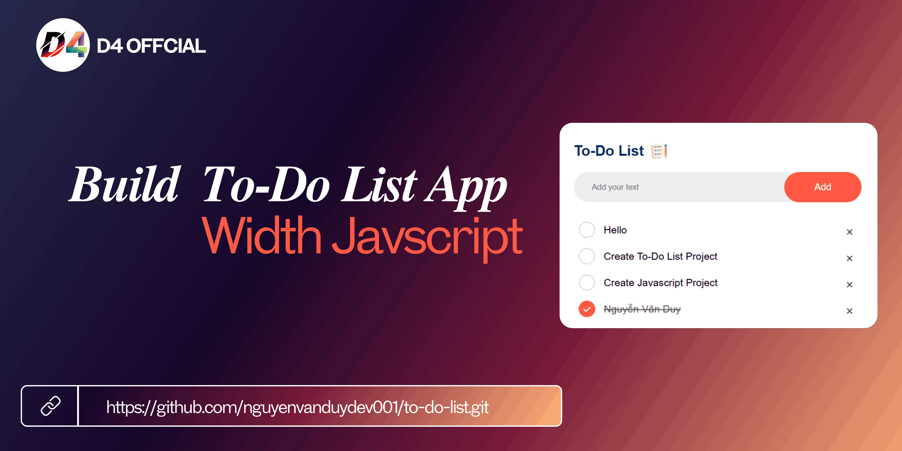

# Building a To-Do List Project

## Demo


## Installation instructions

```
git clone https://github.com/nguyenvanduydev001/to-do-list.git 
```
----

## What the project helps to learn
> The to-do list application is one of the classic projects that a web developer starts with. It gives insight into two major parts of web development: user interactions and data management on the front end. This project will help you become familiar with JavaScript event handling, DOM manipulation, and user input validation.
